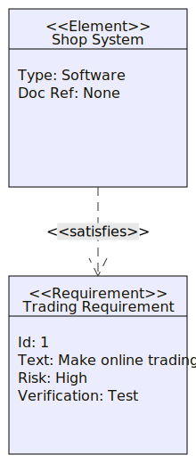

TRUE FRIENDS

## Описание проекта

Стартап. Предлагается сервис, в котором каждый может подобрать для себя подходящий вариант досуга. В дальнейшем планируется реализовать персональные предложения по досугу для пользователей.

Задача проекта:
- собрать в одном месте различные варианты досуга для людей (бизнес-курсы, спа отели, рестораны,выставки, природные достопримечательности и т.п.)

Потребности аудитории:
- возросшая потребность в новых сервисах, объединяющих досуг и путешествия.
- желание пользователей получать персонализированные рекомендации
- не тратить много времени на планирование своего досуга.

Польза ML для задачи:
Первым этапом необходимо собрать данные с сайта кудаго, обучить модель категоризировать места и мероприятия.  Данные без категорий из других источниковбудут проходить через модель и категоризироваться. Другие источники данных - профильные тг каналы, бизнес (рестораны, организаторы мероприятий и т.д.). У пользователя будет возможность находить и фильровать места по категориям. 

Успехом первого этапа проекта будет прототип приложения под iOS с работающей ML моделью под капотом.

# C4

## Context
'''mermaid
C4Context
    accTitle: TrueFriends
    accDescr: Context

    Person(user, "Пользователь", "Пользователь использует МП для планирования досуга")
    Container_Boundary(tf, "TrueFriends") {
        Container_Ext(mobile_app, "Мобильное приложение", "Swift", "Мобильное приложение,в котором пользователь может подобрать себе мероприятие")
        ContainerDb(database, "База данных", "SQL Database", "Хранит сырые данныемероприятий и мест из различных источников и обработанные данные")
        Container_Ext(ml, "ML модели", "Категоризируют места и мероприятия")
    }
    System_Ext(tf_system, "TrueFriends System", "Хранит ключевую информацию")

    Rel(user, mobile_app, "Использует")
    Rel(mobile_app, database, "Читает данные")
    Rel(mobile_app, ml, "Использует для категоризации")
    Rel(mobile_app, tf_system, "Хранит нформацию")
    Rel_R(ml, database, "Использует данные для дообучения, данные хранятся в HDFS")
'''

## Containers

'''mermaid
C4Context
    accTitle: TrueFriends
    accDescr: Containers

    Person(user, "Пользователь", "Пользователь использует МП для планирования досуга")

    System_Boundary(TrueFriends, "TrueFriends") {
        Container(mobile_app, "Мобильное приложение", "Swift", "Мобильное приложение,в котором пользователь может подобрать себе мероприятие")
        Container(backend, "Бэкэнд", "Rest API", "Обрабатывает запросы")
        ContainerDb(database, "База данных", "SQL Database", "Хранит сырые данныемероприятий и мест из различных источников и обработанные данные")
        Container(ml, "ML модели", "Python", "Категоризируют места и мероприятия, данные для обучения хранит в HDFS")
        Container(parsers, "Парсеры", "Python", "Собирают данные из другихисточников (тг каналы, сайты и т.д.)")

        System_Ext(tf_system, "TrueFriends System", "Хранит ключевую информацию")

    }

    Rel(user, mobile_app, "Использует")
    Rel(mobile_app, backend, "Отправляет запросы")
    Rel(backend, database, "Читает запросы)
    Rel(ml, database, "Сохраняет обработанные данные")
    Rel(parsers, ml, "Отправляет данные для модели")
    Rel(parsers, tf_system, "Предоставляет данные")
'''

## Components

'''mermaid
C4Context
    accTitle: TrueFriends
    accDescr: Components

    Person(user, "Пользователь", "Пользователь использует МП для планирования досуга")

    Container_Boundary(app, "Сервис", "") {
        Component(mobile_app, "Мобильное приложение", "Swift", "Мобильное приложение,в котором пользователь может подобрать себе мероприятие")
    }

    Container_Boundary(backend, "Бэкенд", "") {
        Component(api, "API", "Rest API", "Предоставляет способы и правила для взаимодействия")
        Component(processing, "Обработка данных", "Python", "Обрабатывает данные")
    }

    Container_Boundary(parsers, "Парсеры", "") {
        Component(kudago, "KUDAGO", "Python", "Сбор данныхс сайта кудаго")
        Component(tg, "TG", "Python", "Сбор данных из профильных тг каналов")
        Component(mp, "MP", "Python", "Предложения в мп, которые оставляют пользователи через заявки")
    }

    Container_Boundary(storage, "Хранилище", "") {
        Component(database, "База данных", "SQL Database", "Хранит сырые данныемероприятий и мест из различных источников и обработанные данные")
        Component(hdfs, "HDFS", "HDFS", "Хранит данные и работает с ними")
    }

    Container_Boundary(modeling, "ML", "") {
        Component(ml, "ML модели", "Python, PyTorch", "Категоризируют места и мероприятия, данные для обучения хранит в HDFS")
        Component(spark, "Spark", "Обработка и анализ данных", "Обрабатывает данных")
    }

    Rel(user, mobile_app, "Использует")
    Rel(mobile_app, api, "Отправляет запросы")
    Rel(api, processing, "Отправляет запросы")
    Rel(kudago, spark, "Парсинг данных с сайта Кудаго")
    Rel(tg, spark, "Парсинг данных из профильных тг каналов")
    Rel(mp, spark, "Парсинг данных из МП")
    Rel(spark, hdfs, "Передает данные")
    Rel(spark, ml, "Использует")
    Rel(spark, database, "Хранит")
    '''

# UML UC + SysML REQ

## Use Cases

'''mermaid
graph
    user("User") --> app("MP")
    
    app -->|main product| main("Stock analytics")
    app -->|secondary product| hse("Data terminal")
    main -->|number| sentiment("Current sentiment")
    main -->|text| news("Latest news")
    hse --> single_company("Single company")
    hse --> sector_data("List of companies / Industry sector")
    main -->|summarization| summarized_content("Summarized info")
    single_company -->|summarization| summarized_content("Summarized info")
    single_company -->|raw data| raw_single_company("Stock news with sentiment")
    single_company -->|aggregation| analyze_reviews("Aggregated news (avg. sentiment over period)")
    
    sector_data --> |aggregation| analyze_reviews("Aggregated news (avg. sentiment over period)")
'''

## Requirements

